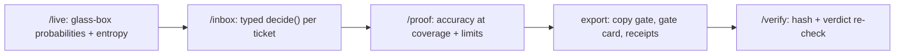
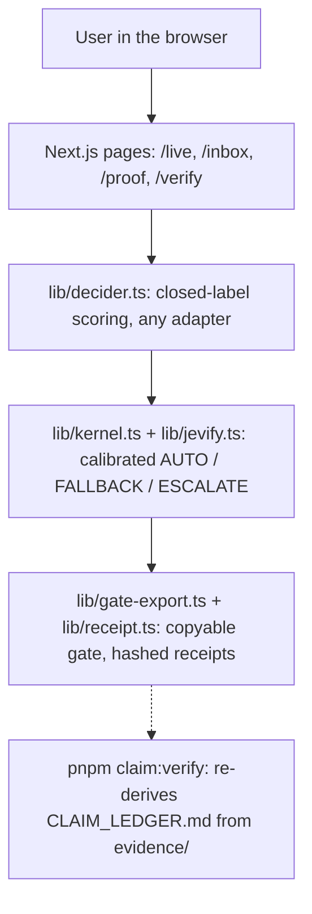

# WEV

WEV Jevifies any local model, for free: see inside it, give it a typed decision mode, calibrate it, and gate it. A tiny model runs in your browser with transformers.js; plain code decides, per item, whether your app may act on the answer, fall back to normal generation, or must escalate to a human.

> **Engineered by Ayodeji Adesegun** ([@ayodejiades](https://github.com/ayodejiades)) · **Live:** [wev-one.vercel.app](https://wev-one.vercel.app)

[](https://github.com/ayodejiades)
[](https://wev-one.vercel.app)


## Try it

- **Live URL:** [https://wev-one.vercel.app](https://wev-one.vercel.app) (zero signup, runs on device)
- **Inspect:** `/live`: type a prompt, see next-token probabilities and full-vocabulary entropy.
- **Decide + gate:** `/inbox`: 40 held-out tickets stream through the shared triage decider with live auto-handled / escalated / wrong-auto counters. `DEMO_MODE=1` replays the committed captured runs and says so.
- **Measured result:** `/proof`: accuracy at coverage from the captured runs, with the limits panel.
- **Export + verify:** `/inbox` copies the gate wrapper and gate card; `/verify` re-checks any decision receipt, including tamper detection.
- **How it was checked:** [`CLAIM_LEDGER.md`](CLAIM_LEDGER.md). `pnpm claim:verify` re-derives every number from the committed runs.
- **The demo, step by step:** [`docs/DEMO_PATH.md`](docs/DEMO_PATH.md), narrated in [`docs/NARRATION.md`](docs/NARRATION.md).

## Measured result

On 100 synthetic support tickets with SmolLM2-135M-ONNX (uint8), seeded 50/50 split: the model alone gets 33/100 right. The calibrated gate (confidence ≥ 0.5, entropy ≤ 6 bits) auto-handles 5/50 held-out items at 10.0% coverage with 60.0% accuracy, versus a 40.0% always-trust baseline, with 2 wrong auto-actions and 45 escalated. Unflattering parts included: the model is right only a third of the time, so the honest gate mostly escalates.

Second model, same method: SmolLM2-360M-ONNX (uint8) captured 34/100 on the same synthetic set and calibrated to distinct thresholds (confidence ≥ 0.5, entropy ≤ 3 bits, reflecting its different entropy scale). On the held-out 50: 14 auto-handled at 28.0% coverage with 50.0% accuracy versus a 32.0% always-trust baseline, with 7 wrong auto-actions and 36 escalated. Thresholds are per-model and never reused across models: the method travels, the numbers do not. Full runs: `evidence/captured-runs-360m.json`.

## How it works

Inspect, decide, calibrate, gate, export:



Architecture:



The in-browser model downloads ~130MB once from a CDN on first run and is cached locally thereafter. The thresholds, accuracy and coverage numbers come from `evidence/` once `pnpm capture && pnpm calibrate` have run.

## Run it

Prerequisites: Node 18+ and pnpm (the repo pins pnpm@10.33.0).

```bash
pnpm install
pnpm dev           # local dev server
pnpm capture      # real SmolLM2 runs on data/items.json -> evidence/captured-runs.json
pnpm calibrate     # seeded 50/50 split -> evidence/thresholds.json + evidence/calibration.json
pnpm claim:verify  # re-derives all claims in CLAIM_LEDGER.md and WHAT_IS_REAL.md
pnpm test          # runs the test suite
pnpm build         # production build
pnpm start         # serve the production build
```

Reproducing the numbers needs no key and no server: capture downloads the public ONNX weights once (cached after), calibrate is pure computation on the captured runs. `DEMO_MODE=1` runs the app offline on committed fixtures and captured runs.

## What is real

What is built, partial or not wired yet, measured rather than claimed: [`WHAT_IS_REAL.md`](WHAT_IS_REAL.md).

## AI disclosure

Built with generative AI coding assistance: scaffolding, copy drafts, refactors, and test assistance were AI-generated under human direction and reviewed before commit. The kernel thresholds, fixtures, and verification results are deliberate human decisions, re-derived from committed data by `pnpm claim:verify`.

## Credits

Assets and open-source attributions are listed in [`CREDITS.md`](CREDITS.md).
